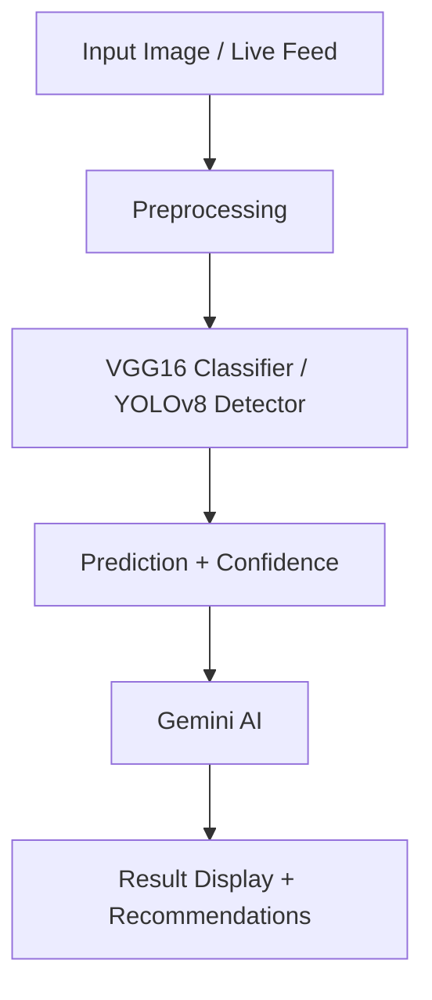

Here's a professionally written, optimized, and well-structured `README.md` documentation for your **CottonVision-AI** GitHub project, including all essential sections, integration with Gemini AI, and dataset details.

---

# 🌱 CottonVision-AI – Cotton Disease Detection System

> **AI-powered real-time detection system for cotton plant diseases with expert-level recommendations.**  
> Combines Machine Learning, Deep Learning (YOLO), and Gemini AI for advanced agricultural diagnostics.

---

## 📸 Live Demo Preview


---

## 🚀 Project Features

- 🔍 Real-time cotton plant disease detection using YOLOv8
- 📷 Webcam integration and image upload functionality
- 🧠 Gemini AI-powered expert treatment and analysis suggestions
- 🧪 High-accuracy model using VGG16 + YOLOv8
- 📊 Detailed disease severity and confidence analysis
- 🧰 Flask-based backend with seamless frontend integration
- 🌐 Responsive UI for mobile & desktop

---

## 🧠 Technologies Used

| Area | Stack |
|------|-------|
| **Frontend** | HTML, CSS, JS, Bootstrap, Flowbite |
| **Backend** | Python, Flask |
| **ML Model** | VGG16, YOLOv8 |
| **AI Integration** | Gemini AI (for recommendations) |
| **Deployment** | Localhost (can be deployed via Render/Heroku) |

---

## 📂 Dataset

- **Name**: Custom Cotton Disease Dataset  
- **Download Link**: [Click here to access dataset](https://drive.google.com/drive/u/0/folders/1jqgzO7XrKWLOSWWNHRWK5h8GgQDTVo9E)
- **Classes**:
  - Healthy Leaves
  - Diseased Leaves
  - Healthy Plants
  - Diseased Plants

**Structure**:
```
dataset/
│
├── train/
│   ├── healthy_leaf/
│   ├── diseased_leaf/
│   └── ...
│
└── val/
    ├── healthy_leaf/
    ├── diseased_leaf/
    └── ...
```

---

## 🤖 How Gemini AI is Used

Gemini AI generates:
- 📋 Disease Descriptions
- 💊 Treatment Plans
- 🛡️ Precautionary Measures
- ⚠️ Severity-based Analysis

Sample output:
```
Disease: Cotton Boll Rot
Confidence: 45.85%
Recommendation: Use Carbendazim-based fungicide. Ensure proper aeration. Remove infected bolls.
```

---


## 🧪 Model Pipeline



---

## 🛠️ How to Run Locally

### 🔧 Prerequisites

- Python 3.8+
- pip
- Git

### 📥 Clone the repo
```bash
git clone https://github.com/shubhampund9325/CottonVision-AI.git
cd CottonVision-AI
```

### 🧰 Install requirements
```bash
pip install -r requirements.txt
```

### ▶️ Run Flask server
```bash
python app.py
```

> Visit: `http://127.0.0.1:5000`

---

## 📌 Project Structure

```
CottonVision-AI/
│
├── static/              # CSS, JS, Assets
├── templates/           # HTML templates
├── model/               # Trained model files
├── app.py               # Main Flask app
├── gemini_integration/  # Gemini AI response handler
├── requirements.txt     # Python packages
└── README.md            # Project doc
```

---

## 📈 Future Enhancements

- 🌍 Deployment on Render/Heroku
- 📱 Android mobile app integration
- 🗣️ Voice-based recommendations
- 🧠 Fine-tuned Gemini prompts for more natural response

---

## 👨‍💻 Author

**Shubham Pund**  
📧 [Contact](mailto:shubhampund9325@gmail.com)  
🔗 [LinkedIn](https://www.linkedin.com/in/shubhampund9325)

---

## 📄 License

MIT License. Feel free to use with credits.

---

Would you like this to be saved as a `.md` file or pushed into your GitHub project?
